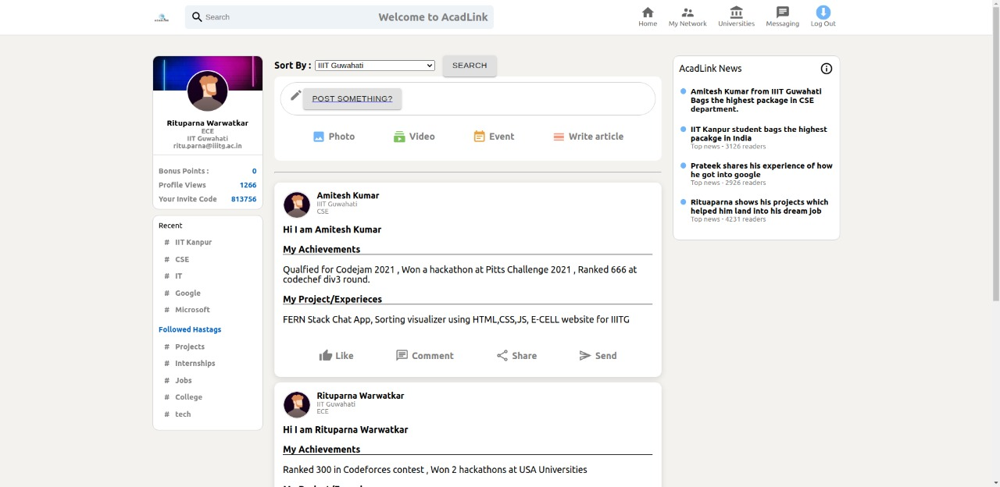
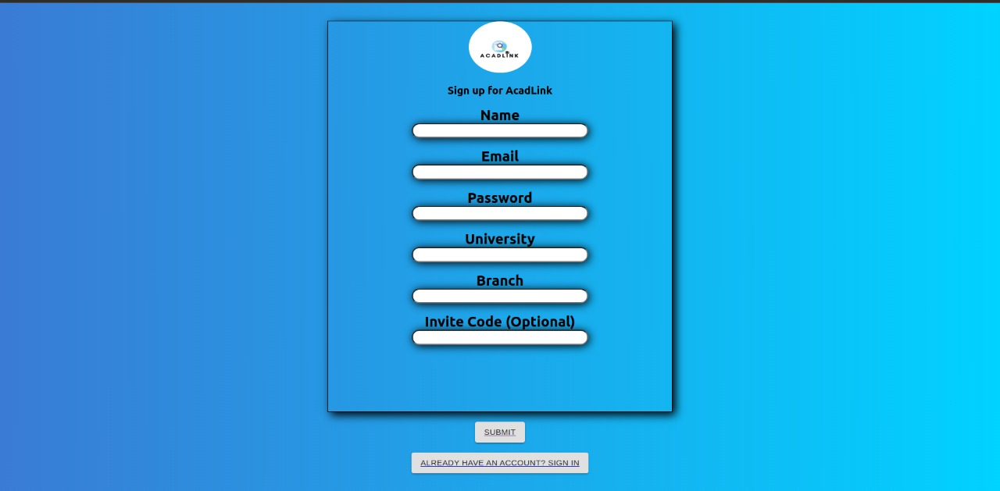
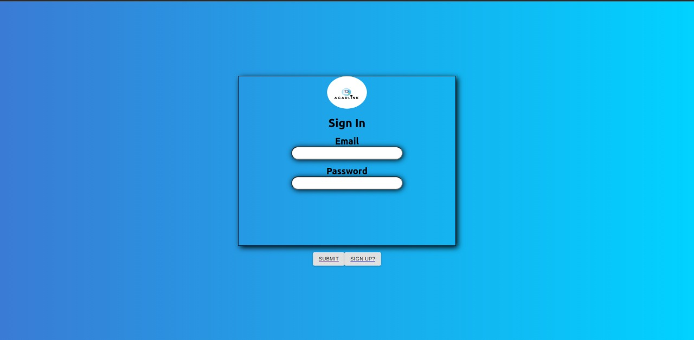
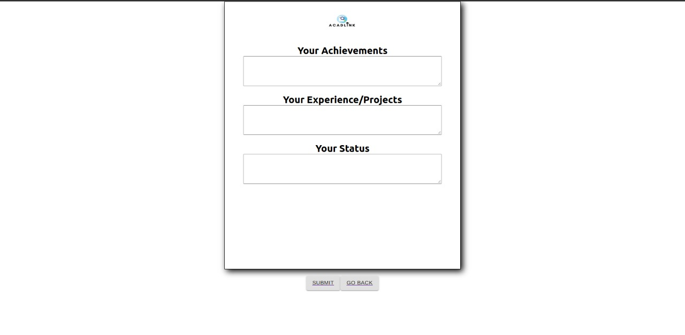

# AcadLink
 # AcadLink

 
 
.

## Try it out

<!--https://acadlink.netlify.app/-->

## What it does?

* `This project is a web-based application aimed at making a platform where college students can use it to capture their work based experiences and share learning experiences with others through texts, photos and videos.`

* `This way, the app not only creates new relationship between students but also allows others to see what they are doing and how they did it and take help from it.`

* `Users can create accounts, join different classrooms, earn referral points. There is filter in app to filter out different Universities students according to their classes. Every student in a class can post their achievements, work experience, project, etc to share with other people.`

## How we have done it :

- `We have used **MERN** stack to build a full fledged social media platform for students to showcase their acheivements and experiences.`
- `It will be solving a lot of peer group problems, same class students can see where their friends are and how they did it and connect with them.`
- `Our App has an invite feature where one can invite a user to join his/her class. User gets Points for this.`
- `One can filter posts by universities or Branch`
- `One can share his/her achievements, experiecnes and projects which will be shown in their feed along with other who posted it.`

## Team members
- **Nitish kumar** (Leader)   : IILM College Of Engineering And Technology
- **Anuj gangwar**     : IILM College Of Engineering And Technology
- **Prateek singhal**      : IILM College Of Engineering And Technology

  <!--### Contributors :
<!-- readme: contributors -start -->
<table>
<tr>
    <td align="center">
        <a href="https://github.com/starnik007">
            
             
            <b>Nitish kumar</b>
        </a>
  </td>
    <td align="center">
        <a href="https://github.com/rituparna-ui">
            
             
            <b>Rituparna Warwatkar</b>
        </a>
    </td>
    <td align="center">
        <a href="https://github.com/prateek-sinha01">
            
             
            <b>Prateek Kumar Sinha</b>
        </a>
    </td></tr>
</table>-->
<!-- readme: contributors -end -->

## Some Screenshots from the App

 <h3>Home Page </h3>
 
 

 

 <h3>Sign Up Page </h3>
 
 

 

 <h3>Login Page </h3>
 
 

 

 <h3>Create a Post Page </h3>
 
 

